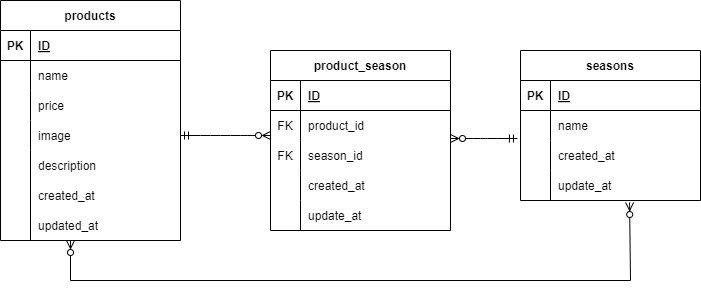

# Mogitate - 製品管理アプリケーション

## 環境構築

1. リポジトリをクローンします。

    ```bash
    git clone http://github.com/katagirikana/mogitate.git
    cd mogitate
    ```

2. Dockerのビルドを行い、コンテナを起動します。

    ```bash
    docker-compose build
    docker-compose up -d
    ```

3. コンテナ内に入ってマイグレーションを実行します。

    ```bash
    docker exec -it mogitate_php_1 bash
    php artisan migrate
    php artisan db:seed
    ```

## 使用技術 (実行環境)

- Laravel 8.x
- PHP 8.x
- MySQL 5.7
- Docker 19.03.0

## ER図


## URL

- 開発環境: http://localhost/
